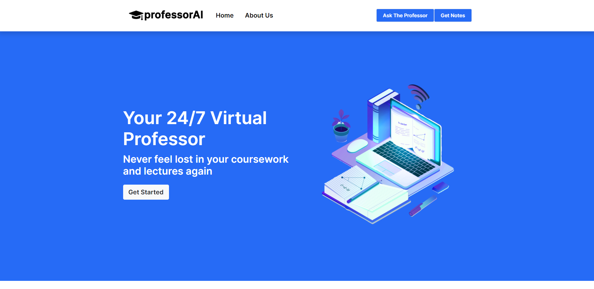
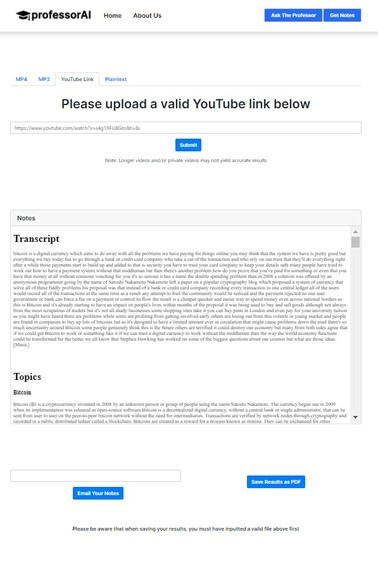
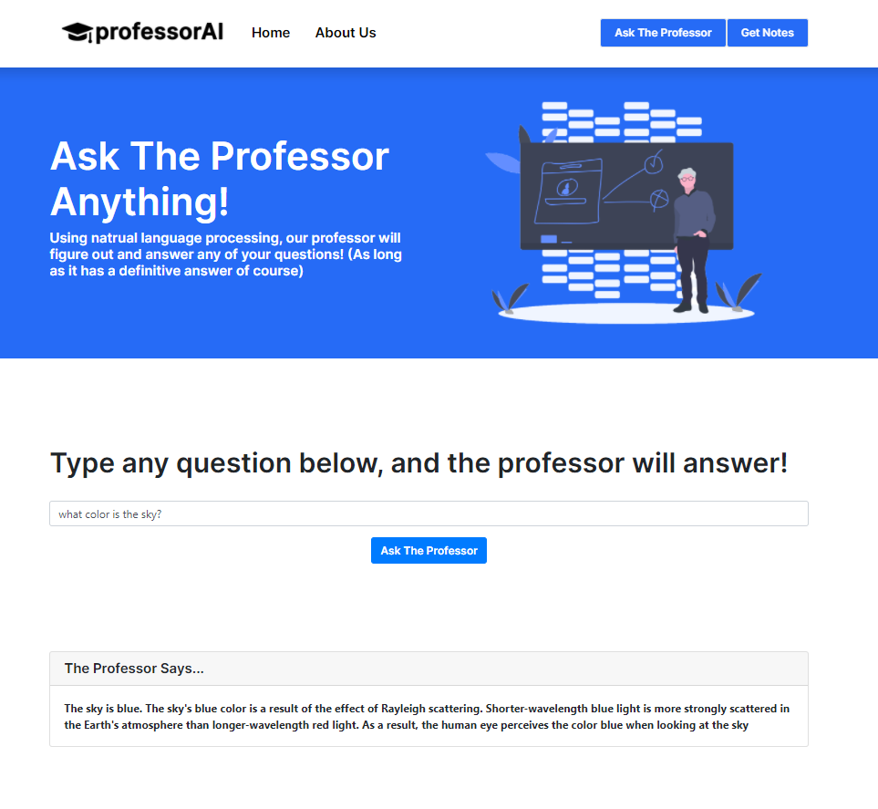

# professorAI
*"Your personal professor whenever you need it."*

**Linghacks III Hack**
- A web application that utilizes natural language processing and webscraping to break down a student's video lecture and provide summarized notes and resources on the key ideas of it.

## Authors
- Ahaan Limaye @ahaanlimaye
- Aryan Pal @aryanpal132
- Eric Line @erice04
- Roland Yang @whyroland

## What it Uses

- Front end: HTML, CSS, JS, Bootstrap 4, JQuery
- Back end: Node.js, Express.js
- Other: Google Cloud, Google NLP, Google Storage, TextRazor, Newsapi, Mediawiki, JSPdf, FFMPeg

## Devpost
https://devpost.com/software/name-xazq3o

## Awards at GunnHacks 7.0
- 3rd Place Overall

## Try It Out
- Clone the GitHub Repository
- Traverse to the folder in your command line of choosing
- Run "app.js"
- Go to "localhost:80" in your internet browser
- **NOTE: Since this is a public repository, we removed our API Keys and Credentials from this public version. If you want a fully functioning version you will have to replace those keys with your own**
